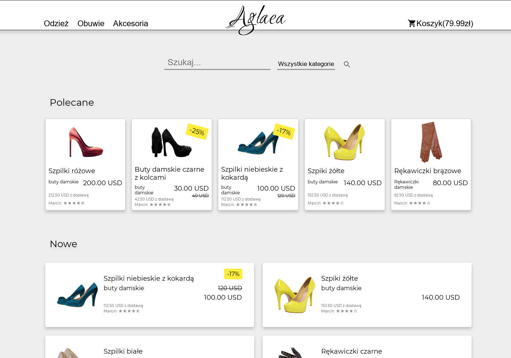

# Aglaea

Online shop project for statup

##### fake backend hosted on heroku, may take a while to start

[Design on figma.com](https://www.figma.com/file/ccLaUY374e9law7xswYQqi/Aglaea?node-id=0%3A1)

[>>>>> GitHub Pages Build <<<<<](https://kifner-mateusz.github.io/aglaea/).

| feature      | status      |
| ------------ | ----------- |
| main ui      | done        |
| main actions | in progress |
| categories   | in progress |
| product ui   | planned     |
| cart         | planned     |
| login        | planned     |

#### `yarn start`

Runs the app in the development mode. 
Open [http://localhost:3000](http://localhost:3000) to view it in the browser.
